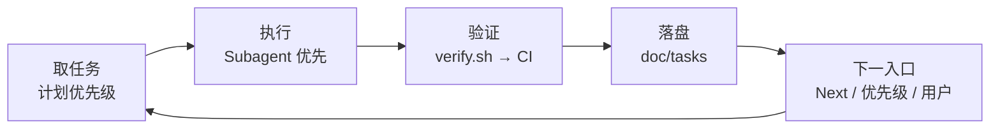

# 自动推进（Agent 默认）

当主对话**没有给出具体目标**时，仓库约定 Agent **不得空转结束**，应从「计划」中取出**下一条可执行最小步**并推进闭环。

**完整约束（含 Subagent、串行、任务记录、CI）** 以仓库根目录 [`.cursor/rules/supervisor-subagent.mdc`](../.cursor/rules/supervisor-subagent.mdc) 为单一权威；本文是人读的摘要，与上述文件同步意图。

**可测规模与报告**：每个合入切片须满足 [[FEATURE_SCOPE]]（验收 = test/既有 smoke）；推送后 GitHub Actions 中的 **`ci-summary`** 仅产出 **shell 写的 Summary**，**不调用 LLM**，见 [[CI_REPORT]]。

## 根任务循环（一览）

下面即「主会话根循环」；与工程上的 [[WORKFLOW]]（Issue → PR）**互补**：WORKFLOW 讲人在 GitHub 上的协作；本节讲 **Cursor 里 Agent 如何不空转地完成小步**。

1. **取任务**：按下一节「计划来源与优先级」选出**一条**最小可合入步；若队列空，按优先级向上扫描（tasks → 已落账 Issue / 已分诊 Discussion → PLAN_V0 → ROADMAP 与 proposals 的可拆步 → README 外链），直到找到可做项或确认无事可做。
2. **执行**：代码改动优先由 **Subagent** 完成；主会话只做目标、验收、监督、合并意图；**不并行**多个 Subagent。
3. **验证**：每步结束前本地 `scripts/verify.sh`（与 `.github/workflows/ci.yml` 中 test **等价**）；有远程则 **push**，以 **CI 绿**为该步远程验收；失败则修到绿再继续。
4. **落盘**：推进或结束任务时更新 `doc/tasks/*.md`；每次向 Subagent **新发**子任务时应 **新建**一条任务记录（见 [[tasks/README]]）。
5. **下一入口**：闭环后心智复位；下一小步只读 **`Next` 字段**、再跑一遍计划优先级、或等**用户新指令**——不默认延续已解决的对话链。

**等人 vs 继续**：推送后可暂停与人交互；若 workflow **已结束**而用户长时间无指令，Agent 应回到 CI 结果与计划优先级**继续下一小步**，不以干等会话为唯一终点（与 `.mdc` 中「超时后继续迭代」一致）。

## 任务来源（从哪里来）

与 `.cursor/rules/supervisor-subagent.mdc` 中「任务来源」一致。下面区分 **类型**（计划长什么样）与下一节的 **顺序**（先取哪一条）。

| 来源 | 用途 | 进入「可执行计划」的条件 |
| --- | --- | --- |
| **`doc/tasks/`** | 队列、`Next`、会话恢复 | `status` 为 `running` / `queued`（见优先级 ①） |
| **GitHub Issue** | 缺陷、功能、`Driven-By`、可追溯工单 | 已分诊；正文含目标/验收/计划，或链回 `doc/tasks`、`doc/proposals` |
| **GitHub Discussion** | 设计、共识、FAQ | **须分诊结案**（采纳结论、指回仓库，或已**派生 Issue**）；未收敛讨论不自动进计划 |
| **长期目标** | `doc/ROADMAP.md` 阶段、`doc/proposals/` 大设计、置顶/roadmap 帖 | **不**当单步直接做；先拆成 Issue 或 `doc/tasks` 最小步（常落在 ④⑤） |
| **`doc/PLAN_V0.md`** | 自动化基线验收 | 见优先级 ③ |

Issue / Discussion 的结论应能指回仓库里的 **单一事实来源**（可复制进上下文），避免只在聊天里口头约定。

**维护者如何把 Discuss/Issue「吃进去」变成文档与工单**（已在 ROADMAP 的 Issue 如何关、Discussion 已阅与按更新时间再读、结论落库）：见 [[SOURCE_TO_FEATURE]]。

## 计划来源与优先级（取用顺序）

与 `.cursor/rules/supervisor-subagent.mdc` 中「计划优先级」**一致**；数字是 **取用顺序**，不是各来源业务上的重要性。

| 顺序 | 取什么 |
| --- | --- |
| ① | `doc/tasks/` 中 `running` / `queued`（优先推进在办） |
| ② | **已落账的 GitHub**：合条件的 **Issue**，及**已分诊**、可追溯仓库的 **Discussion**（或派生 Issue）；**同一档内**优先路径清晰的 **Issue** / **Driven-By** 链 |
| ③ | `doc/PLAN_V0.md` 尚未满足的验收 |
| ④ | **`doc/ROADMAP.md` 当前阶段下一里程碑** 与 **`doc/proposals/` 已决议条目中拆出的下一最小步**（须可独立合入；通常先落到 Issue 或 `doc/tasks`） |
| ⑤ | `doc/README.md` 导航的开放链路（协作帖、roadmap issue 等），仍拆成小步 |

**无 Driven-By 时**：只做仓库内不争议的小步（文档、测试、CI 自洽）；需拍板或权限的项在任务里标 `blocked` 并写明缺什么（见 `.mdc`）。

## 与 CI / PR 门禁的关系

- PR 仍须满足 `Driven-By` 等门禁，见 [[WORKFLOW_GITHUB_DRIVEN]]；分支保护与必需 check，见 [[GITHUB_SETUP]]。
- 验证与「推送后等待 Actions」的纪律见上文 **根任务循环** 第 3 步与「等人 vs 继续」；细则亦在 `.cursor/rules/supervisor-subagent.mdc` 的「小步提交、CI 验证与等待用户」。

## 停机与复盘（自动化要迭代的部分）

若本轮**必须停下**（无法在仓库内继续推进），主会话应**简短记录**并尽量**改一条规则或文档**，避免下次在同一处卡住：

| 常见原因 | 改进动作示例 |
| --- | --- |
| 无法连接 GitHub | **优先**：确认 Cursor [[GITHUB_MCP]] 可用并用 MCP 发帖/拉取；**其次**：安装 `gh` 并 `gh auth login`；**再其次**：把草稿放在 `doc/issues/` 人工粘贴，或按 [[GITHUB_DISCUSSION_OPS]] 用 `curl` + `GITHUB_TOKEN` |
| 目标含糊 | 把验收写进 `doc/tasks/` 或 Issue 正文，再启动 Subagent |
| CI / 格式 / staticcheck 失败 | 本地先跑与 CI 同等的检查；必要时在 `doc/GITHUB_SETUP.md` 注明必需 job 名称变化 |

**原则**：停机原因要能从 **git 里的某次提交** 或 **`doc/tasks` 某条记录** 追到，而不是只留在聊天里。

关联：[[WORKFLOW]] [[tasks/README]] [[README]]
