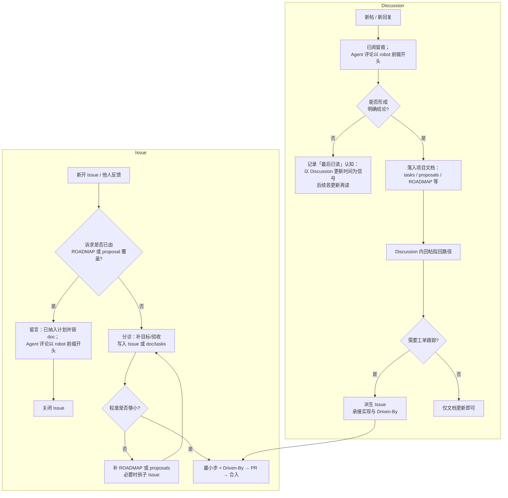

# 从 Issue / Discussion 到功能落地（消化路径）

说明 **GitHub Issue、Discussion、仓库长期文档** 如何衔接：哪些情况直接收口、哪些要落库、何时再读 Discussion、以及何时进入可编码队列（`doc/tasks`、Issue、`Driven-By`、PR）。与 [[AUTO_ADVANCE]] 的「任务来源」互补：本文讲 **人/维护者如何消化来源**；根循环讲 **Agent 取任务顺序**。

## 机器人留言：`[robot]` 前缀

凡由 **Cursor Agent / 自动化** 在本仓库 GitHub 上发布的**评论类内容**（Issue 评论、Discussion 回复、Pull Request 上的 issue／review 评论等），正文须 **以 `[robot]` 开头**（后接空格或直接接正文），例如第一条为 `[robot] 已阅` 或 `[robot]\n\n段落…`。人工维护者自行输入的留言**不**强制加此前缀。

下列模板中凡注明由 Agent 代发时，已按此前缀书写。

## 总览图



## Issue：已在 ROADMAP（或提案）里写了的怎么办

若经核对，诉求**已经**体现在 `doc/ROADMAP.md`、`doc/proposals/*.md` 或已接受的计划 Issue 中：

1. **留言**说明「已包含在计划中」，并给出 **仓库内路径**（及可选章节标题），避免只有口头确认。
2. **关闭 Issue**（若仍要单独跟踪实现进度，可另开 **更细** Issue，并设新的触发评论与 `Driven-By`）。

**由 Agent 发帖（须带前缀）**：

```markdown
[robot] 已在仓库计划中覆盖，见 [doc/ROADMAP.md](https://github.com/jiayuwangcj/wbot/blob/main/doc/ROADMAP.md)（说明对应阶段/表格行）。本 Issue 作为重复诉求关闭。若需要单独跟踪某一实现切片，请新开 Issue 并附上 `Driven-By` 指向的触发评论。
```

**人工发帖**：可不使用 `[robot]`；内容可与上一段相同，仅去掉第一行前缀。

## Discussion：已阅、再读、与落库

Discussion 用于**开放式讨论**；与 Issue 分工不同，消化规则如下。

| 步骤 | 做法 |
| --- | --- |
| **读过留痕** | 维护者或 Agent 在帖内或最新相关串下留言 **「已阅」**。**Agent 代发**时须 **`[robot] 已阅`**（可后接简短说明）。 |
| **何时再读** | 以 GitHub 上 Discussion 的 **最后活动/更新时间** 为信号：若自上次「已阅」之后 **有新增回复或编辑**，则维护者应**再读**并视情况更新结论；若无更新，则不因时间流逝单独重读全文（节省时间）。 |
| **形成结论时** | 将结论 **写入项目文档**（择一或多：`doc/tasks/*.md`、`doc/proposals/`、[[ROADMAP]]、与实现相关的说明），并在 Discussion 里 **回帖指回文件路径**（单一事实来源在仓库）。 |
| **需要写代码时** | 从 Discussion **派生 Issue**（或在已有 Feature Issue 下用锚点评论承接），再走 [[WORKFLOW_GITHUB_DRIVEN]] 的 `Driven-By` → PR。 |

仅「已阅」、尚无结论时：**不**自动进入 Agent 的「可执行计划」；待落库并拆出最小步后，才与 [[AUTO_ADVANCE]] 中的任务来源规则对齐。

## 与计划优先级、根循环的关系

- **消化完成** 的标志通常是：仓库里有一处 **可追溯的 doc 路径** +（若需实现）**Issue 与触发评论**。
- Agent 的 **①～⑤ 优先级**（见 [[AUTO_ADVANCE]]）只消费 **已落账** 的队列与文档；本文件的流程解决 **如何把 Discuss/Issue 变成「落账」**。

## 与自动化操作的关系

通过 MCP 或 API 发帖、列讨论的技术细节见 [[GITHUB_MCP]]、[[GITHUB_DISCUSSION_OPS]]；**本文只约束「内容与流程」**，不约束工具。

关联：[[WORKFLOW]] [[tasks/README]] [[README]]
